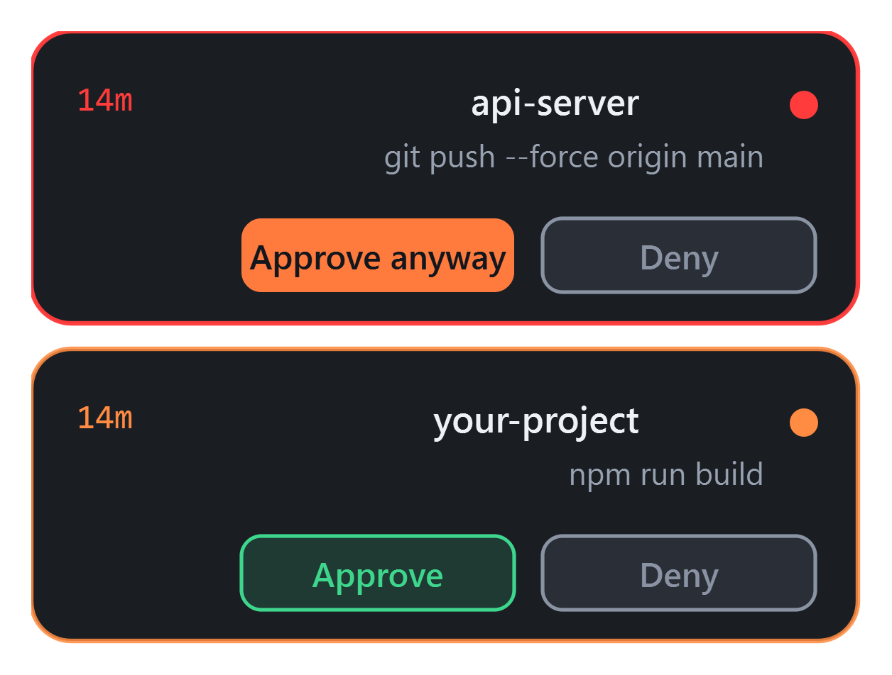
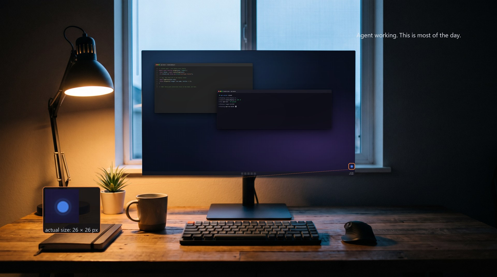
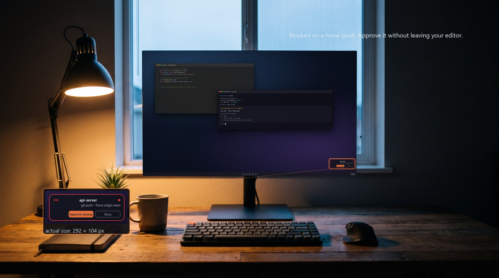
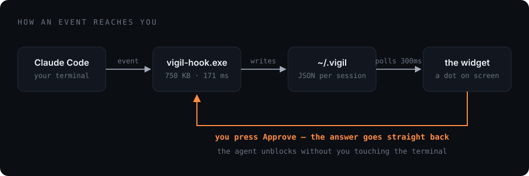
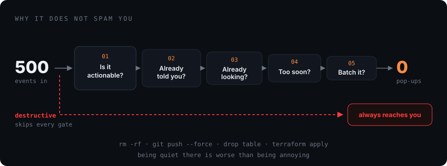
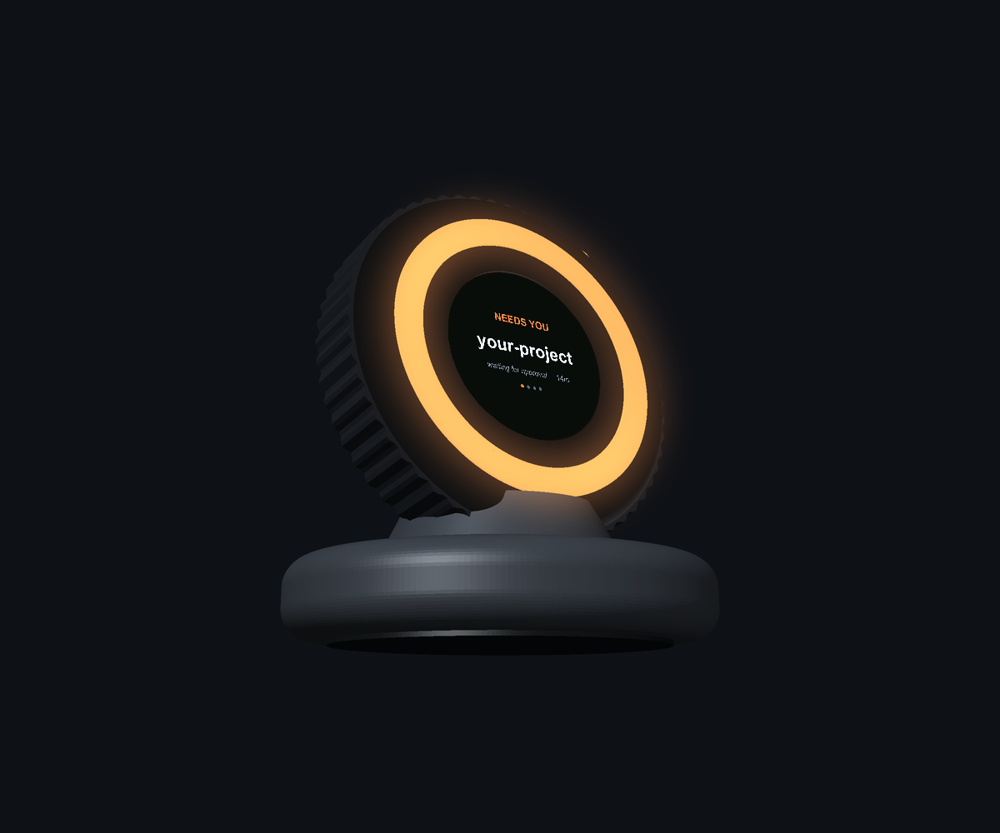

<div align="center">

# Vigil

### A quiet desktop signal for AI coding agents. It opens only when the work needs you.

[](https://github.com/AdiN737/vigil/releases/latest)
[](https://github.com/AdiN737/vigil/releases)
[](#install)
[](#macos)
[](LICENSE)

**Free · No account · No telemetry · No network calls**

**Ships today:** Windows + Claude Code. **In source:** the Codex/ChatGPT coding-agent adapter, ready for real-machine validation and the next packaged release.

[**⬇ Download for Windows**](https://github.com/AdiN737/vigil/releases/latest) &nbsp;·&nbsp; [vigilit.app](https://vigilit.app) &nbsp;·&nbsp; [How it works](#how-it-works) &nbsp;·&nbsp; [Why it won't spam you](#why-it-doesnt-spam-you) &nbsp;·&nbsp; [Install](#install)

<br>



</div>

<br>

## The problem

You give an agent a long task and go do something else. It works for seven minutes, hits a permission prompt, and then sits there — silently, indefinitely. You come back twenty minutes later and nineteen of them were wasted.

So you start checking. Alt-tab, glance, alt-tab back. Except checking **is** the interruption: you break focus to find out you didn't need to.

> You check too often, or not often enough. Both waste the speed you're paying for.

<br>

## On a real screen

The two states that matter, on an actual desktop. Both screens below are the
real widget at real size — 292 × 104 px for the pill, 26 px for the dot —
composited into a photograph, not an artist's impression of a UI.

<div align="center">

<br><em>Agent working. A 26px dot, and nothing else. This is most of the day.</em>
<br><br>

<br><em>Blocked on a force-push. The pill opens, and you answer it from there.</em>
</div>

<br>

## What it does

A small dot lives in the corner of your screen. Most of the time, that is all it is.

When a session genuinely needs a human, it unfurls into a pill showing **which project**, **what it's asking**, and **how long it's been waiting** — with **Approve** and **Deny** on it. Press one and the answer goes straight back to the agent. Then it folds back into a dot.

Run five agents at once and each gets its own row, sorted by urgency, with the dangerous one on top. Collapsed, the dot carries a count.

<br>

## The states

Seven tiers, copied from `TIERS` in [`app/vigil_widget.py`](app/vigil_widget.py). **Three of them never interrupt you — and those three are most of the day.**

| | tier | state | what it means | interrupts you |
|:--:|:--:|---|---|---|
| ⚪ | 1 | `idle` | Nothing running, or the session ended. | colour only |
| 🔵 | 2 | `working` | Your agent is mid-task — reading, editing, running things. | colour only |
| 🟢 | 3 | `done` | It finished and stopped. Nothing is waiting on you. | colour only |
| 🟡 | 4 | `question` | It asked you something and can't continue without an answer. | **opens the pill** |
| 🟠 | 5 | `blocked` | A permission prompt. Approve or deny it from the pill. | **opens the pill** |
| 🔴 | 6 | `failed` | Something errored out. The run stopped short of finishing. | **opens the pill** |
| ⛔ | 7 | `destructive` | Force-push, recursive delete, a dropped table, a deploy. | **always** |

`destructive` isn't a separate kind of event — it's a `blocked` one whose command matched something you can't undo. It's the only tier that ignores every rate limit below.

<br>

## How it works

Two binaries, provider adapters, a folder of small JSON files, and no server.

<div align="center">

</div>

Every design choice below exists because a measurement forced it.

| Choice | Why |
|---|---|
| **Two binaries, not one** | The hook runs on every turn, so it can't afford to load a 91 MB UI framework to decide it has nothing to say. Splitting it out took the hook from **3 s → 171 ms**. |
| **Five hooks, not six** | `PreToolUse` fires on literally every tool call. Dropping it cost nothing in coverage and gave back most of a 7-second-per-turn regression. Total overhead is now **~0.33 s per turn**. |
| **Files, not a daemon** | One small JSON per session, written with an atomic replace, so a busy agent can never half-overwrite what the widget is reading. No server, no port, nothing to leave running. |
| **State in `~/.vigil`** | Not a synced folder (phantom sessions from other machines), and not `%LOCALAPPDATA%` (the Microsoft Store build of Python silently sandboxes writes there). |
| **Provider adapters** | Claude Code and Codex lifecycle hooks normalize into the same small session record. The widget does not need provider-specific UI logic. |
| **Fails open, always** | The hook is wrapped end to end. If Vigil breaks, throws, or is missing entirely, the coding agent prompts exactly as it would without it. |

<br>

## Why it doesn't spam you

A notification you can ignore is one you'll uninstall. Every would-be interruption runs five gates before it's allowed to touch your screen.

<div align="center">

</div>

1. **Is it actionable?** Working, finished and idle never open the pill.
2. **Have we already told you?** One ping per session, not one per event.
3. **Are you already looking?** If the window that needs you is focused, silence.
4. **Is it too soon?** Each recent ping doubles the quiet period after it — 45 s, 90 s, 180 s, up to fifteen minutes.
5. **Can it wait for a friend?** Simultaneous prompts batch into one notice.

In testing, **500 agent events across five concurrent sessions produced zero pop-ups.** The constants controlling all of this sit at the top of [`app/vigil_widget.py`](app/vigil_widget.py) — if it's too chatty or too quiet for you, tune them there rather than adding new triggers.

<br>

## Install

> **Requires [Claude Code](https://claude.com/claude-code).** Vigil reads its hook events and does nothing without them.

**1.** Download the latest zip:

[](https://github.com/AdiN737/vigil/releases/latest)

**2. Extract it properly** — right-click → *Extract All*. Don't run it from inside the zip preview; Windows unpacks that to a temp folder and the install won't stick.

**3. Double-click `Install Vigil.bat`.** It copies Vigil to `%USERPROFILE%\.vigil\app`, registers the Claude Code hooks (backing up your `settings.json` first), and starts it.

**4.** Windows will say **"Windows protected your PC."** The build isn't code-signed yet — that means *unrecognised*, not *unsafe*. Click **More info → Run anyway**.

**5. Restart Claude Code.** Hooks load when a session starts, so existing windows won't report until you open a fresh one.

Then look at the **bottom-right of your screen**, roughly an inch above the taskbar. You'll get a "Vigil is watching" pill for a few seconds, then a dot.

**To uninstall:** double-click `Uninstall Vigil.bat`, or delete `%USERPROFILE%\.vigil` and remove the Vigil entries from `.claude\settings.json`.

<br>

## macOS

**There is no Mac download yet.** PyInstaller cannot cross-compile and Vigil was
built on Windows, so no `.app` exists. The source is fully cross-platform
though, and runs from source in about a minute:

```bash
git clone https://github.com/AdiN737/vigil.git
cd vigil && python3 -m venv .venv && source .venv/bin/activate
pip install -r requirements.txt
python3 app/vigil_setup.py --install   # registers the Claude Code hooks
python3 app/vigil_widget.py            # starts the widget
```

Then two things that are not optional:

1. **System Settings → Privacy & Security → Accessibility** → enable your
   terminal. Without it Vigil still runs, but it cannot tell when you are
   already looking at the window that needs you, so it gets chattier.
2. **Restart Claude Code.** Hooks load when a session starts.

Uninstall with `python3 app/vigil_setup.py --uninstall`.

> **Nobody has run this on a Mac yet.** Everything Windows-only — reading the
> focused window title, raising a window, the single-instance lock,
> start-at-login — has a real macOS implementation in
> [`app/vigil_platform.py`](app/vigil_platform.py), and the imports are
> verified clean. But it is untested, and the Qt frameless always-on-top window
> is the most likely thing to misbehave across Spaces and full-screen apps.
> If you try it, [tell me what happened](https://github.com/AdiN737/vigil/issues)
> — "the dot never appeared" is as useful as "it works".

To build a real `.app` instead, see [docs/MACOS.md](docs/MACOS.md).

<br>

## What it can see

You're about to run an unsigned binary that watches your coding agent. That deserves a straight answer.

| | |
|---|---|
| **Reads** | The folder name of the project · which tool the agent is about to use · the command or file path it's running (first 120 characters) |
| **Never reads** | Your prompts · the agent's replies · the contents of any file in your project |
| **Sends** | Nothing. There are no network calls in the build. No account, no sign-in, no telemetry, no crash reports. |
| **Needs** | No administrator rights · no Python · no config files to edit |

The exact function that decides this is [`describe()` in `app/vigil_hook.py`](app/vigil_hook.py) — it's about fifteen lines, and it's worth reading before you trust any of the above.

<br>

## Repository layout

```
app/
  vigil_widget.py    the UI, the tier table, and the anti-spam gates
  vigil_hook.py      the fast hook Claude Code calls on every event
  vigil_setup.py     registers and removes the hooks in settings.json
  vigil_decide.py    the allow/deny handshake between widget and hook
  *.spec             PyInstaller build specs (widget and hook build separately)
poc/                 the 20-minute proof of concept — no GUI, no hardware
design/renders/      concept renders of the hardware device
design/cad/          STL/3MF models and the generator scripts
docs/HARDWARE.md     build guide for the physical device
```

<br>

## Running from source

Needs Python 3.11+ and PySide6.

```bash
pip install PySide6
python app/vigil_widget.py           # the widget
python app/vigil_setup.py --install  # register the hooks
```

Building the distributable uses the `.spec` files with PyInstaller. **The widget and the hook build separately** — that separation is the whole performance story, so don't merge them.

The current source can register both Claude Code and Codex hooks. Codex asks you to review and trust user hooks once through `/hooks`. See [`docs/PROVIDERS.md`](docs/PROVIDERS.md) for the event contract and [`docs/ASTRA_HANDOFF.md`](docs/ASTRA_HANDOFF.md) for the full GPT-6 Astra continuation prompt.

<br>

## Where this is going

<div align="center">

<br>
<sub><i>Concept render. Not a shipping product.</i></sub>
</div>

A screen widget can only reach you while you're looking at a screen. The decision file the widget writes today is the same file a phone, a watch, or a dial on your desk would write tomorrow.

| | Status |
|---|---|
| The widget — Windows, Claude Code | ✅ **shipping now** |
| macOS build from the same core | 🔨 source ported, needs building + testing on a Mac |
| Codex/ChatGPT coding-agent lifecycle adapter | 🔨 implemented in source; real-machine validation and packaging next |
| Ordinary ChatGPT web chats, Gemini, Cursor via browser extension + native bridge | 📐 planned |
| Physical desk device — LED ring, round display, a dial you press to approve | 📐 designed, not built |

<br>

## Status

**v0.1.1 release:** Windows only, Claude Code only, not code-signed. The main branch now contains a provider-neutral event layer and Codex adapter; do not describe that adapter as released until it has been tested against a real Codex permission request and packaged. It's been stress-tested across simulated eight-hour days, but you'll be among the first real users — [bug reports](https://github.com/AdiN737/vigil/issues) are genuinely useful.

<br>

## License

MIT — see [LICENSE](LICENSE).
